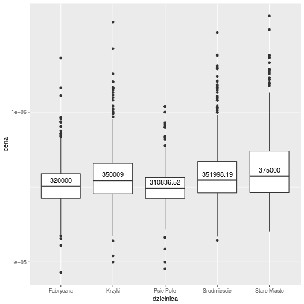
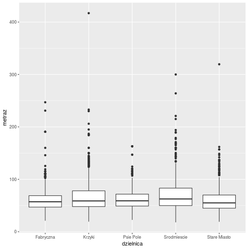
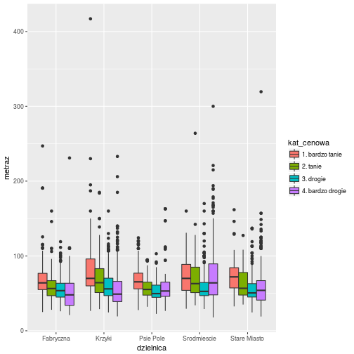
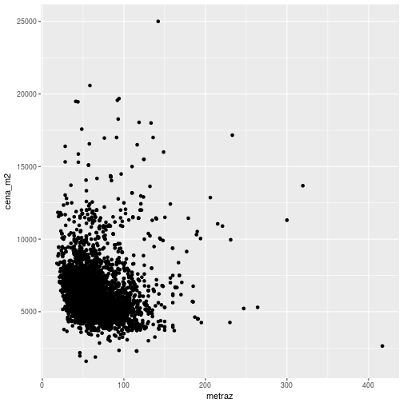

Wizualizacja danych za pomocą pakietu ggplot
========================================================
author: Bartosz Kolasa
date: 07-11-2017
autosize: true
font-family: 'Helvetica'


Materiały
========================================================

Data Visualisation cheatsheet

<https://www.rstudio.com/wp-content/uploads/2015/03/ggplot2-cheatsheet.pdf>

Pakiety:
- ggplot2
- dplyr


Gramatyka wykresów
==============================


Gramatyka wykresów
==============================

```r
library(ggplot2)
ggplot(mpg, aes(hwy, cty)) +
  geom_point(aes(color=cyl)) + geom_smooth(method="lm") +
  coord_cartesian() + scale_color_gradient() + theme_bw()
```


Najprostszy przykład
========================================================

```r
library(ggplot2)
mieszkania <- read.csv("data/mieszkania_wroclaw_ceny.csv")
ggplot(mieszkania, aes(x=dzielnica)) + geom_bar()
```


Zmienna ciągła
======================================================


```r
library(ggplot2)
mieszkania <- read.csv("data/mieszkania_wroclaw_ceny.csv")
ggplot(mieszkania, aes(x=metraz)) + geom_histogram()
```


Ograniczenie danych
===================================================


```r
library(dplyr)
filter(mieszkania, metraz<150) -> mieszkania
ggplot(mieszkania, aes(x=metraz)) + geom_histogram()
```


Kolejny wymiar
===================================================

```r
mieszkania <- read.csv("data/mieszkania_wroclaw_ceny.csv")
ggplot(mieszkania, aes(x=dzielnica, fill=as.factor(n_pokoj))) + geom_bar()
```


Rozsądniejsze kolory
=================================================

```r
library(RColorBrewer)
mieszkania <- read.csv("data/mieszkania_wroclaw_ceny.csv")
ggplot(mieszkania, aes(x=dzielnica, fill=as.factor(n_pokoj))) + geom_bar() + scale_fill_brewer(palette="Reds") 
```


Porównywanie wartości
=================================================

```r
library(RColorBrewer)
mieszkania <- read.csv("data/mieszkania_wroclaw_ceny.csv")
ggplot(mieszkania, aes(x=dzielnica, fill=as.factor(n_pokoj))) + geom_bar(position="fill") + scale_fill_brewer(name="Liczba pokoi", palette="Reds")
```


Etykietki
==============================================

```r
library(RColorBrewer)
mieszkania <- read.csv("data/mieszkania_wroclaw_ceny.csv")
ggplot(mieszkania, aes(x=dzielnica, fill=as.factor(n_pokoj))) + geom_bar(position="fill") +
  scale_fill_brewer(name="Liczba pokoi", palette="Reds") + geom_text(aes(label=..count..), stat="count", position="fill", vjust="bottom")
```


Ostatnie szlify
==============================================

```r
library(RColorBrewer)
mieszkania <- read.csv("data/mieszkania_wroclaw_ceny.csv")
mutate(mieszkania, n_pokoj=if_else(n_pokoj>4, "więcej niż 4", as.character(n_pokoj))) -> mieszkania
ggplot(mieszkania, aes(x=dzielnica, fill=as.factor(n_pokoj))) + geom_bar(position="fill") +
  scale_fill_brewer(name="Liczba pokoi", palette="Reds") + geom_text(aes(label=..count..), stat="count", position="fill", vjust="bottom")
```


Zadania
===========================================
Do użycia nowy zbiór z pliku "data/mieszkania_wroclaw_ceny_rozbudowana.csv"
- Narysuj wykres słupkowy liczby mieszkań w wybranych kategoriach cenowych.
- Zbadaj jak rozkłada się to w zależności od dzielnic.
- Zbadaj odwrotną relację tzn. liczbę mieszkań w określonych kategoriach cenowych w wybranych dzielnicach

Rozkład kategorii cenowych
==============================================

```r
mieszkania <- read.csv("data/mieszkania_wroclaw_ceny_rozbudowana.csv")
ggplot(mieszkania, aes(x=kat_cenowa)) + geom_bar() 
```


Rozkład kategorii cenowych wg dzielnic
==============================================

```r
mieszkania <- read.csv("data/mieszkania_wroclaw_ceny_rozbudowana.csv")
ggplot(mieszkania, aes(x=kat_cenowa, fill=dzielnica)) +  geom_bar(position="fill") 
```


Rozkład dzielnic wg kategorii
==============================================

```r
mieszkania <- read.csv("data/mieszkania_wroclaw_ceny_rozbudowana.csv")
ggplot(mieszkania, aes(x=dzielnica, fill=kat_cenowa)) +  geom_bar(position="fill") 
```


Dwa wymiary
===========================================

```r
mieszkania <- read.csv("data/mieszkania_wroclaw_ceny_rozbudowana.csv")
ggplot(mieszkania, aes(x=dzielnica, y=cena)) +  geom_boxplot() 
```


Skala logarytmiczna
===========================================

```r
mieszkania <- read.csv("data/mieszkania_wroclaw_ceny_rozbudowana.csv")
ggplot(mieszkania, aes(x=dzielnica, y=cena)) +  geom_boxplot()+ scale_y_log10()
```


Z etykietką
===========================================

```r
mieszkania <- read.csv("data/mieszkania_wroclaw_ceny_rozbudowana.csv")
ggplot(mieszkania, aes(x=dzielnica, y=cena)) + geom_boxplot(stat="boxplot") +scale_y_log10() +
  geom_text(data=aggregate(cena ~ dzielnica,mieszkania, median), aes(label=cena, x=dzielnica, y=cena), vjust=-0.75)
```




Bez outlierów
===========================================

```r
mieszkania <- read.csv("data/mieszkania_wroclaw_ceny_rozbudowana.csv")
filter(mieszkania, cena < 1000000) -> mieszkania
ggplot(mieszkania, aes(x=dzielnica, y=cena)) + geom_boxplot(stat="boxplot") +scale_y_log10() +
  geom_text(data=aggregate(cena ~ dzielnica,mieszkania, median), aes(label=cena, x=dzielnica, y=cena), vjust=-0.75)
```


Bez outlierów
===========================================

```r
mieszkania <- read.csv("data/mieszkania_wroclaw_ceny_rozbudowana.csv")
ggplot(mieszkania, aes(x=dzielnica, y=cena)) + geom_boxplot(stat="boxplot") +scale_y_log10() +
  geom_text(data=aggregate(cena ~ dzielnica,mieszkania, median), aes(label=cena, x=dzielnica, y=cena), vjust=-0.75) + ylim(1e5, 1e6)
```


Wykres punktowy
===========================================

```r
mieszkania <- read.csv("data/mieszkania_wroclaw_ceny_rozbudowana.csv")
ggplot(mieszkania, aes(x=metraz, y=cena_m2)) + geom_point() +facet_wrap(~dzielnica)
```




Wykres z rozrzutem
===========================================

```r
mieszkania <- read.csv("data/mieszkania_wroclaw_ceny_rozbudowana.csv")
ggplot(mieszkania, aes(x=metraz, y=cena_m2)) + geom_jitter(size=0.1) +facet_wrap(~dzielnica) 
```



Wykres z pomocnikiem...
===========================================

```r
mieszkania <- read.csv("data/mieszkania_wroclaw_ceny_rozbudowana.csv")
ggplot(mieszkania, aes(x=metraz, y=cena_m2)) + geom_jitter(size=0.1) + geom_smooth(method="loess") + facet_wrap(~dzielnica) 
```


... i poprawioną skalą
===========================================

```r
mieszkania <- read.csv("data/mieszkania_wroclaw_ceny_rozbudowana.csv")
filter(mieszkania, metraz<150) -> mieszkania
ggplot(mieszkania, aes(x=metraz, y=cena_m2)) + geom_jitter(size=0.1) + geom_smooth(method="loess") + facet_wrap(~dzielnica)
```



... i bez Starego Miasta
===========================================

```r
mieszkania <- read.csv("data/mieszkania_wroclaw_ceny_rozbudowana.csv")
filter(mieszkania, metraz<150, dzielnica != "Stare Miasto") -> mieszkania
ggplot(mieszkania, aes(x=metraz, y=cena_m2)) + geom_jitter(size=0.1) + geom_smooth(method="loess") + facet_wrap(~dzielnica)
```


